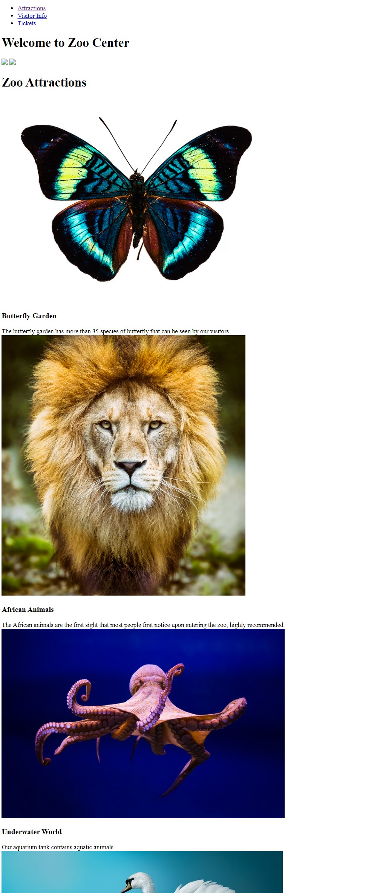

# Module 8: Using Layouts, CSS and JavaScript in ASP.NET Core MVC

## Lab: Using Layouts, CSS and JavaScript in ASP.NET Core MVC

1. **Nombres y apellidos:** Francisco Javier Moreno Quevedo
2. **Fecha:** 02/12/2020
3. **Resumen del Ejercicio:** Añadir los componentes necesarios para hacer funcional la aplicacion de venta de un Zoo 1/4
4. **Dificultad o problemas presentados y como se resolvieron:** Ninguna

- Ejercicio 1: Applying a Layout and Link Views to it
- Creamos el Layout y añadimos codigo para el menu
  - Añadimos una vista **Index.cshtml** que contendra las fotos del modelo
  - Añadimos una vista **_ViewStart.cshtml** 
  - Añadimos al proyecto el resto de vista preconstruidas
  - Añadimos el RenderBody al layout

